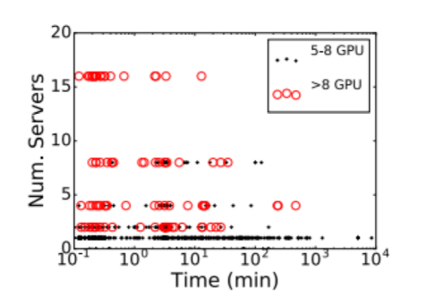
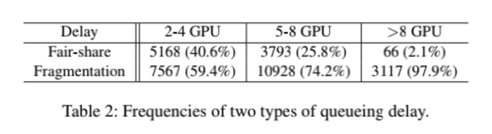

# Analysis of Large-Scale Multi-Tenant GPU Clusters for DNN Training Workloads

## 作者提出分布式机器学习系统中出现的三个问题：
- (1) 作业调度
-（2）GPU利用率
- (3) 训练中会产生的错误

### 作业调度
- 由于分布式机器学习中要求资源限制而使用gang调度算法，因此会产生资源碎片导致利用率不高。
- 由于需要同步参数因此分布式作业locality非常重要，但也由于locality的调度限制也产生了排队延时。作者研究表明，通过放宽locality的限制可以减少队列延时并且防止因资源时时满足不了要求而导致的作业饿死的情况。
- 为了避免产生资源碎片，可以将小的job打包到含有碎片资源服务器中以减少资源碎片，但同时引入的问题是不同的job之间将由于资源的竞争而产生干扰。因此作者研究在colocation 与distribution之间进行trade-off，通过测量数据观察如何影响的GPU利用率。
- 下图反映了，job需要的gpu越多可使用的机器就越分散，反之使用的需要的gpu越少可使用的机器越集中越能满足locality需求

- 产生排队时延的两个因素：
（1）调度公平性（剩余总资源不够了）
（2）locality需求以及资源碎片（剩余总资源够但是不满足locality调度需求）
从下表可以看出，任务需要的gpu越多，因为碎片资源而产生的调度时延占比越大

### GPU利用率
- 作者提出两个影响GPU利用率低的因素
- 1.由于忽略了作业间的locality限制，所以造成同步参数的开销，影响力GPU利用率
- 2.不同作业打包在相同的节点上由于共享GPU资源导致了竞争
- gang调度算法与基于locality的调度算法都会影响GPU利用率。

### 训练中失败的原因
作者列出了基本上所有常见的分布式训练中可能出现的问题，并将问题分成了六类：
- Incorrect inputs
- Semantic error
- Model checkpoint error
- MPI runtime failure
- Job preempted
- Invalid memory access

作者提出的解决方法：因为大部分的错误都是在用户端产生的，因此可以利用pre-run的方式，在job正式提交到集群上时，可以先在一个资源较小的测试集群中去验证从而避免因一些用户端的代码错误而导致集群资源浪费。

### 作者对未来调度器设计的一些展望：
（1）对那些因为资源不满足locality限制而relaxed的作业，在后续资源满足locality时我们可以进行作业的迁移。
（2）对于某些可能要要运行很长时间占用很多gpu的大作业，如果进行relaxed可能会产生10-20%的作业运行效率下降，因此此时最好是花更长的时间去等待满足locality限制
（3）为了减少作业间的干扰，不将不同的作业打包到同一个服务上运行，而是将他们分置在确定的服务上，这样会提高资源的碎片产生，并且还会延长排队时延。解决这种问题的方式就是适时进行作业迁移，提高大作业的job间的locality

