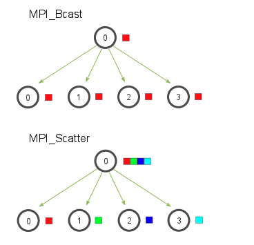
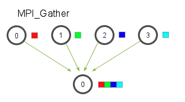
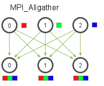
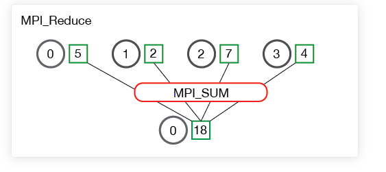

## Horovod源码剖析：

### 核心模块 -- operations
1. horovod/common/operations.h

### 首先了解一下mpi常见的通信操作
  1. MPI-Scatter：scatter与broadcast类似都是一对多的通信，将一段array 的不同部分发送给所有的进程
  2. MPI-Boardcast：与scatter进行区分，broadcast是将0号进程将相同的信息发送给所有的进程；
  
  3. MPI-Gather：MPI_Gather和scatter刚好相反，他的作用是从所有的进程中将每个进程的数据集中到根进程中，
  同样根据进程的编号对array元素排序
  
  4. MPI-Allgather:当数据分布在所有的进程中时，MPI_Allgather将所有的数据聚合到每个进程中。
定义的操作：
  
  5. MPI-Reduce:所有节点上的值进行规约（求和）
  
  6. MPI-Allreduce：reduce之后在进行boardcast，

### horovod 定义的通信算子
   1. Allreduce: 将所有process的目标数组reduce为单个数组，并将计算结果返还给所有process
   2. Allgather: 与scatter刚好相反，是从所有的进程中将每个进程的数据集中到根进程中
   3. Broadcast：
   4. join